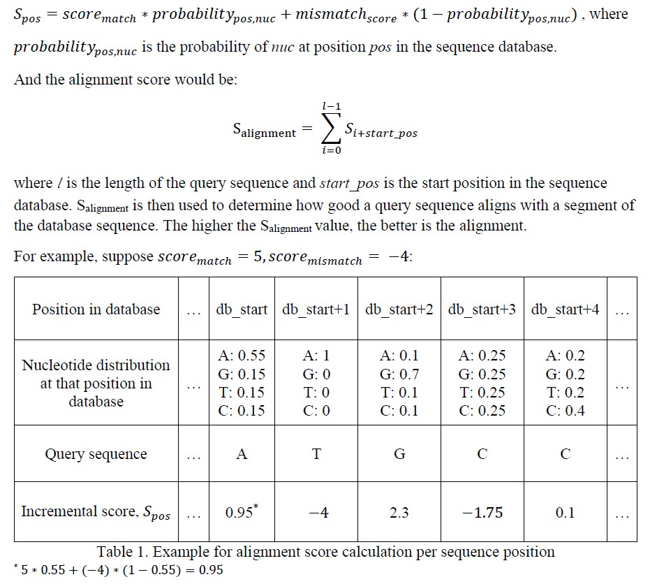

# BLASTn Variation for Probabilistic Genome Sequences
(Term Project for Computational Biology Methods and Research(COMP-561))

## Introduction
The Basic Local Alignment Search Tool(BLAST) has been widely used in searching and comparing newly discovered DNA and amino acid sequences within database that contain well-studied genome sequences. In this project, I defined a alignment scoring scheme and made adjustments to BLAST algorithm to work with probabilistic genome sequence query. A probabilistic genome sequence is a genome sequence such that the nucleotide at each position might not be certain, that is, another nucleotide could be placed there as well with a probability.  

## Dataset
Professor Mathieu Blanchette provided a portion of chr22 of the predicted BoreoEutherian ancestor sequence, which contained 604,466 nucleotides, along with the confidence value, the probability of the predicted nucleotide being correct, for each position of the sequence. (https://www.cs.mcgill.ca/~blanchem/561/probabilisticGenome.html)

I generated query sequences of length 100 using this probabilistic genome sequence. For each query sequence, the script randomly selects a start position from the probabilistic genome sequence, and then proceeds to build the query sequence by adding a nucleotide from {“A”, “C”, “G”, “T”} chosen based on the probability of the corresponding position in the probabilistic genome sequence.

## Method
For each query sequence, our goal is to find the start and end positions from the database sequence. I used the top ranking positions following the BLAST algorithm with the below scoring scheme:
For each nucleotide in query sequence, the incremental score is

